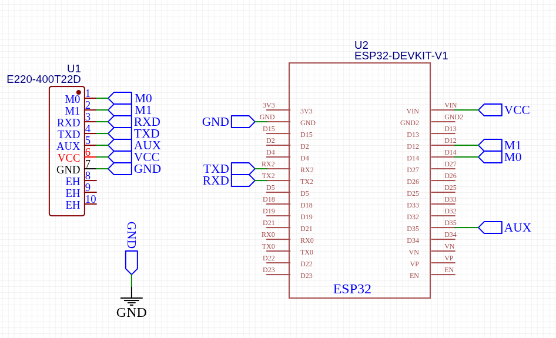

# 📡 E220LoRa Library

A lightweight and efficient Arduino/ESP32 library for interfacing with the **Ebyte E220-400T22D LoRa module** using UART communication.  
This library provides an easy way to configure, send, and receive data with the E220 module — supporting mode control, and AUX monitoring.

---

## 🚀 Features

- ✅ Simple UART communication interface  
- ✅ Supports ESP32 HardwareSerial (UART2 by default)  
- ✅ Easy mode switching (Normal / Configuration)  
- ✅ AUX pin monitoring for safe transmission timing  
 
- ✅ Includes working examples  

---

## ⚙️ Hardware Connections (ESP32 Example)

| E220 Pin | Description | ESP32 Pin | Notes |
|-----------|--------------|------------|-------|
| **TXD** | LoRa → ESP32 | **GPIO16 (RX2)** | LoRa transmits, ESP32 receives |
| **RXD** | ESP32 → LoRa | **GPIO17 (TX2)** | ESP32 transmits, LoRa receives |
| **AUX** | Module status | **GPIO18** | HIGH = idle, LOW = busy |
| **M0** | Mode select 0 | **GPIO4** | Mode control |
| **M1** | Mode select 1 | **GPIO5** | Mode control |
| **VCC** | Power | **3.3V** | Stable 3.3V recommended |
| **GND** | Ground | **GND** | Common ground |

---

## 🔌 Hardware Connection Diagram

<p align="center">
  
</p>

---

## 🧩 Installation

### Option 1 – Manual Installation
1. Download or clone this repository:
   ```bash
   git clone https://github.com/franfreezy/e220_400t22d-lora-library.git


## 🧩 Important

Use two E220 modules with matching addresses and channels for quick point-to-point LoRa testing.

## 🧑‍💻 Author

**Frandel**
Co-Founder of Tethics Electrics Group

🔗 Connect with me:

💼 [LinkedIn](https://www.linkedin.com/in/frandel-wanjawa)  
🌐 [Portfolio](franfreezy.github.io/DearestFW/)